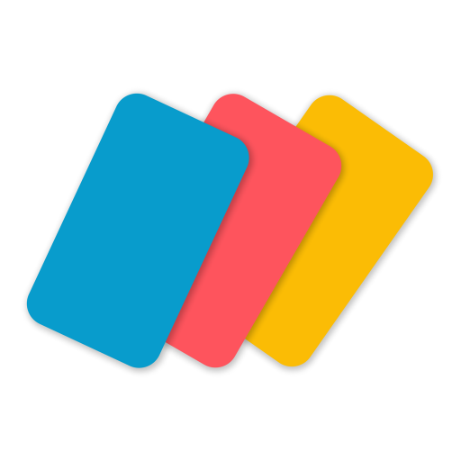

# Card Gen

> Take control of your learning journey with CardGen - the perfect tool for organizing and managing your flashcards and notes.

CardGen is the ultimate app designed to unleash your potential for effective note-taking and memory retention. With its core features, CardGen empowers you to effortlessly create comprehensive notes and flashcards, while seamlessly managing and organizing them at the note level.

  

Key Features:

1. Note Creation: Craft detailed and personalized notes using CardGen's intuitive editor.

2. Flashcard Creation: Support creating and editing flashcards.

3. Card Management: Stay organized by organizing your flashcards at the note level. Group and categorize your flashcards within each note to make reviewing and revisions a breeze.

4. Smart Study Tools: Take advantage of CardGen's built-in study tools to optimize your learning. Utilize features such as spaced repetition and self-paced quizzes to master your flashcards and maximize memory retention.

5. Sync and Backup: Never lose your valuable notes and flashcards. CardGen seamlessly syncs your data across devices, ensuring that your study materials are accessible whenever and wherever you need them.

Whether you're a student, professional, or lifelong learner, CardGen is your all-in-one solution for effective note-taking, flashcard creation, and efficient studying. Revolutionize the way you learn and make knowledge retention a breeze with CardGen. Start unlocking your full potential today!

## Privacy Policy
https://flashcard-seven.vercel.app/#/privacy

## Terms and Conditions
https://flashcard-seven.vercel.app/#/terms

## Contact US

If you have any questions, feel free to submit an issue to this github repository

Or you can email us: lvshun@live.cn
